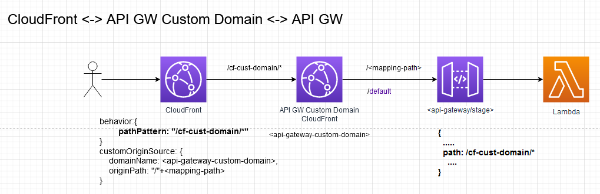

# CloudFront reverse proxy API Gateway to prevent CORS

In this blog we will do a quick recap of CORS and reverse proxies. Then we will show how a reverse proxy can eliminate
 CORS, specifically in the context of a SPA hosted on CloudFront with an API Gateway backend. The sample code focuses
  on public, authenticated routes (Authorization header) and IAM signed request all being reverse proxied through 
  CloudFront. Everything is done with the AWS CDK... continue reading the accompanying blog post 
  here => https://www.rehanvdm.com/serverless/cloudfront-reverse-proxy-api-gateway-to-prevent-cors/index.html

This is a stock standard CDK project using TypeScript. 

### Prerequisites:
1. AWS IAM profile setup in `..\.aws\credentials`, with Admin rights.
3. AWS CDK bootstrap must have been run in the account already.

### Up and running
 * Run `npm install`
 * Change directory to ***/src/frontend/src*** and run `npm install`
 * Create an ACM certificate and Hosted zone. These are only needed to use and test the API Gateway Custom domain
 * Search and replace `rehan` with your AWS profile name
 * Replace the CDK context variables values in the package.json file, both `custDomainCertArn` and `custDomainName` 
 with the values of resources you created above

### Useful commands
 * `cdk diff`                   compare deployed stack with current state
 * `cdk deploy`                 deploy this stack

### Other
You can navigate to the frontend under /src/frontend/dist to view the basic HTML page used to make requests.